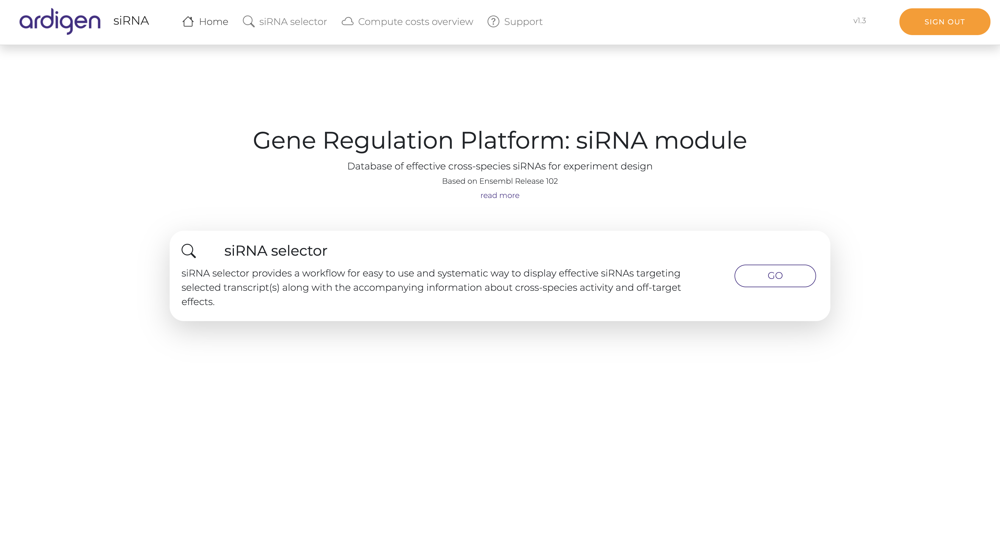
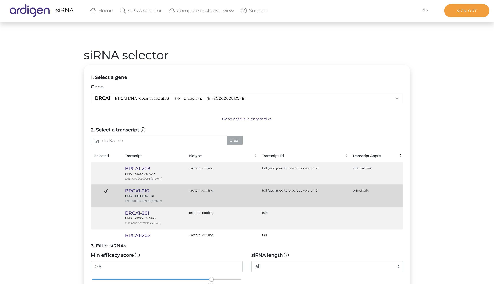
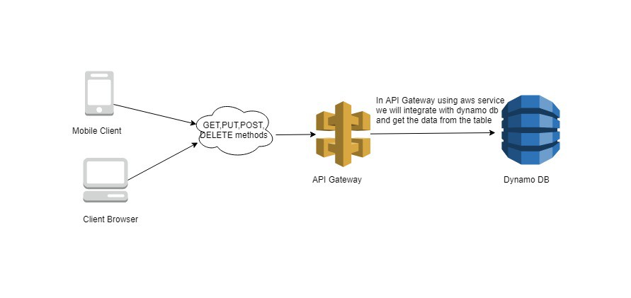

<!-- Global style -->

<!-- Title page style -->

# No code REST APIs
## Karol Horosin

--- 

# Why?

---

---

---

# Goals

---

## Rapid development

---

## Low infrastructure cost

---

## Quick turnaround

---

## Easy maintenance

---

# Limitations

---

# Over 25GB - $0.25 per GB

---

# 6MB request size

---

# Architecture

---

# Karol Horosin
## Software Engineer
### karol.horosin@ardigen.com

---

Setting account permissions to use CloudWatch Logs
https://gist.github.com/villasv/4f5b62a772abe2c06525356f80299048

Similar scope, using SAM
https://www.andmore.dev/blog/build-serverless-api-with-no-lambda/

Using GUI from amazon
https://aws.amazon.com/blogs/compute/using-amazon-api-gateway-as-a-proxy-for-dynamodb/

Polish GUI article
https://chmurowisko.pl/serverless-bezposredni-dostep-do-dynamodb-z-api-gateway/

---

Using GUI
https://medium.com/@likhita507/using-api-gateway-to-get-data-from-dynamo-db-using-without-using-aws-lambda-e51434a4f5a0

Useful article with similar example but many errors in yaml
https://itnext.io/setting-up-api-gateway-with-dynamodb-using-cloudformation-a8ab3e70f494

Examples from AWS
https://docs.aws.amazon.com/apigateway/latest/developerguide/api-gateway-swagger-extensions-integration.html

---